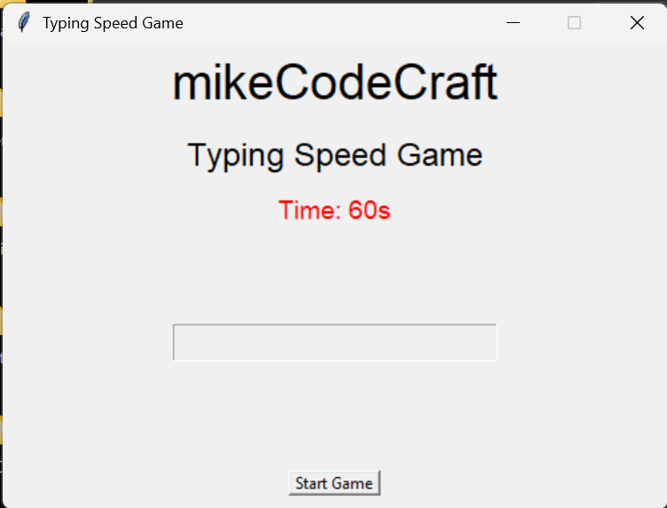

# React App Portfolio

This is a modern React-based portfolio application built with Vite and Tailwind CSS. It showcases various projects, user authentication, and a responsive design.

## Features

- **User Authentication**: Register, login, and protected routes for user profiles.
- **Project Showcase**: View detailed descriptions and images of multiple projects, including:
  - Clipboard Manager
  - Currency Converter
  - File Organizer
  - Key Logger
  - QR Code Generator
  - Typing Game
  - Weather Checker
  - Background Remover
- **Profile Management**: Update user profile and view skills.
- **Responsive Design**: Optimized for all devices using Tailwind CSS.
- **Modern UI**: Clean and attractive interface with custom components.

## Tech Stack

- [React](https://react.dev/)
- [Vite](https://vitejs.dev/)
- [Tailwind CSS](https://tailwindcss.com/)

## Getting Started

1. **Clone the repository**
   ```sh
   git clone <repo-url>
   cd react-app
   ```
2. **Install dependencies**
   ```sh
   npm install
   ```
3. **Start the development server**
   ```sh
   npm run dev
   ```
4. **Open in browser**
   Visit [http://localhost:5173](http://localhost:5173) to view the app.

## Project Structure

```
react-app/
├── public/               # Static assets
├── src/
│   ├── api/              # API utilities
│   ├── assets/           # Images and icons
│   ├── components/       # React components
│   ├── hooks/            # Custom hooks
│   └── styles/           # CSS files
├── App.jsx               # Main app component
├── index.html            # HTML template
├── package.json          # Project metadata and scripts
├── tailwind.config.js    # Tailwind CSS config
├── vite.config.ts        # Vite config
└── ...
```

## Available Scripts

- `npm run dev` — Start the development server
- `npm run build` — Build for production
- `npm run preview` — Preview the production build

## Screenshots



## License

This project is licensed under the MIT License.
